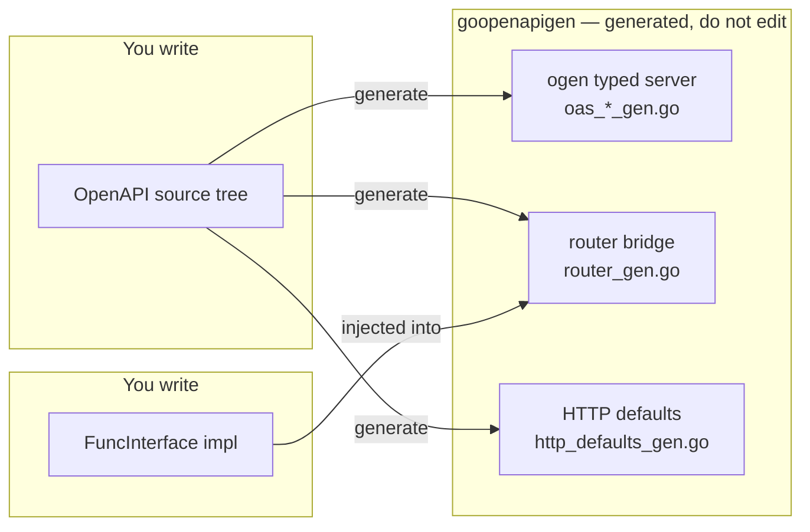
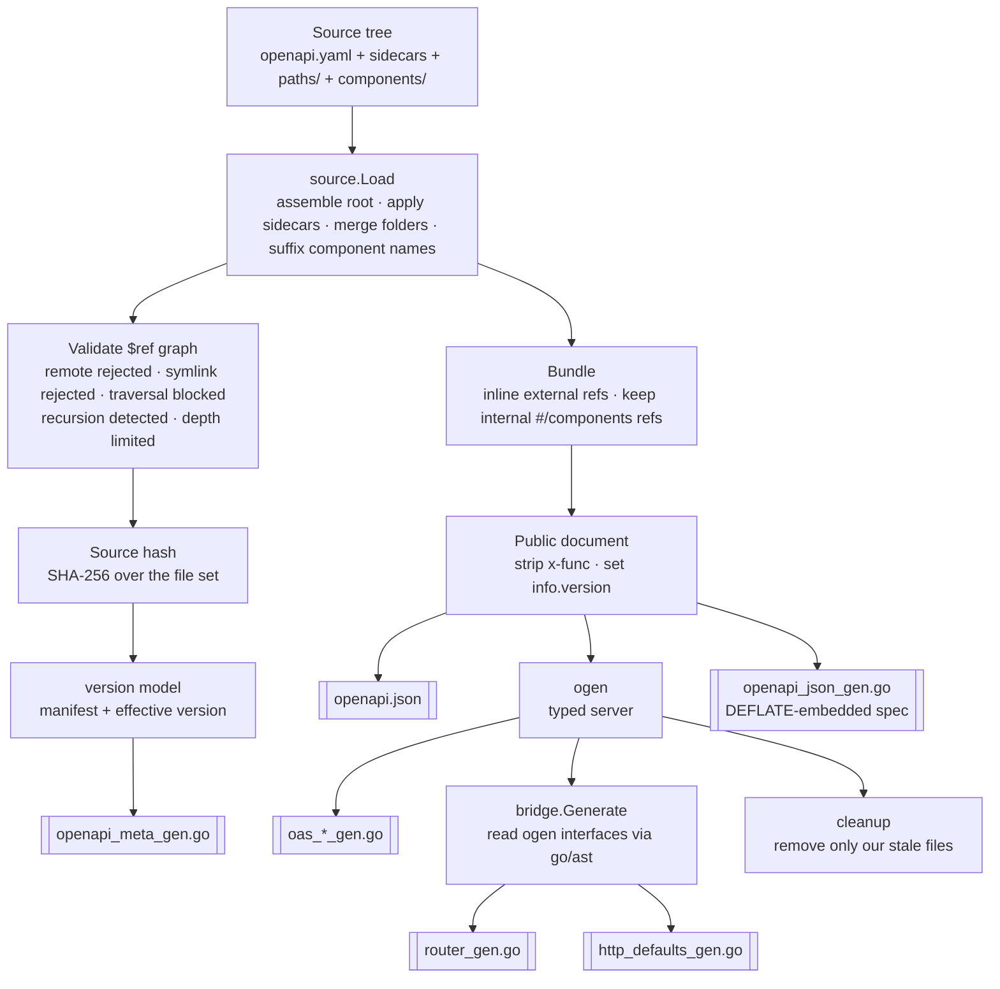
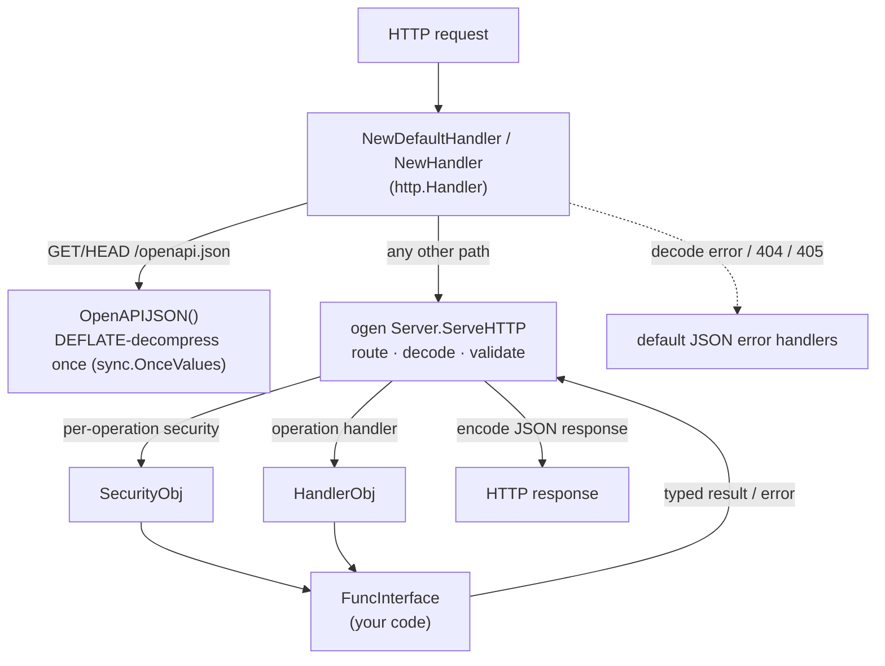

# goopenapigen

`goopenapigen` turns an OpenAPI spec that you keep as **many small files** into a ready-to-serve, typed Go HTTP server.

You write OpenAPI split across a folder tree, run one command, and implement **one Go interface**. The tool assembles
the tree into a single OpenAPI document, runs [`ogen`](https://github.com/ogen-go/ogen) to generate the typed server,
and emits a thin **router bridge** plus optional HTTP defaults, an embedded spec, and version metadata. No generated
file is ever edited by hand.

It is both a **CLI** (`cmd/goopenapigen`) and a **Go library** (the root package).

---

## What you get

- **Folder-based OpenAPI.** Keep paths and components as separate files; routes and component names are derived from the
  file tree. No giant `openapi.yaml`.
- **Typed server via ogen.** Routing, request decoding, response encoding, and schema validation are all generated.
- **One implementation seam.** You implement a single generated `FuncInterface`; the compiler tells you if anything is
  missing or drifts.
- **Batteries-included HTTP.** Optional JSON error handler, 404/405 handlers, and a `GET /openapi.json` endpoint.
- **Self-contained spec.** The public `openapi.json` (internal `x-func` stripped) can be embedded into the binary,
  compressed.
- **Version + integrity model.** A content hash of the source tree drives an effective version and `meta.*` manifest.
- **Deterministic & safe.** Stable output (regeneration is a no-op), atomic writes, and a hardened `$ref` resolver
  (no remote refs, no symlinks, no path traversal, recursion and depth limits).

---

## Table of Contents

- [Mental model](#mental-model)
- [Install](#install)
- [Quick start](#quick-start)
- [The pipeline](#the-pipeline)
- [Source layout](#source-layout)
  - [Root file](#root-file)
  - [Root sidecars](#root-sidecars)
  - [`paths/` and `components/`](#paths-and-components)
  - [Component naming](#component-naming)
  - [References](#references)
- [Generated files](#generated-files)
- [Generated code & runtime](#generated-code--runtime)
- [Using the generated code](#using-the-generated-code)
- [Naming rules](#naming-rules)
- [Version model & source hash](#version-model--source-hash)
- [Commands & flags](#commands--flags)
- [Safety guarantees](#safety-guarantees)
- [Repository examples](#repository-examples)

---

## Mental model

Three layers. You own the first and the last; the middle is generated and never edited.



---

## Install

`ogen` is required for the `generate` command (the `json`, `meta`, and `manifest` commands don't need it):

```bash
go install github.com/ogen-go/ogen/cmd/ogen@latest
```

The generator finds `ogen` on `PATH`, then `~/go/bin`, then `GOPATH/bin`, or you point at it with `-ogen-command`.

Run the tool from source:

```bash
go run github.com/amazing-generators/goopenapigen/cmd/goopenapigen help
```

---

## Quick start

Generate every Go artifact from a source tree:

```bash
go run ./cmd/goopenapigen generate \
  -source ./examples/source \
  -out ./target/api \
  -pkg api \
  -force
```

Generate only the public OpenAPI JSON (no `ogen` needed):

```bash
go run ./cmd/goopenapigen json generate \
  -source ./examples/source \
  -out ./tmp \
  -force
```

`-out` is always a **directory**; file names are fixed by the tool. With `-force`, a missing output directory is
created and stale generated files are removed; without it, a missing directory is an error.

---

## The pipeline

`generate` is a deterministic pipeline (each box is an `internal/*` package):



Two design points worth knowing:

- **The bridge reads the real ogen output.** It parses the generated `Handler` / `SecurityHandler` interfaces with
  `go/ast` and copies method signatures verbatim. If ogen changes a signature, the bridge follows — there is no second
  source of truth to keep in sync.
- **Everything is in memory.** The assembled document, bundling, and the public JSON are built in memory; only a
  temporary spec is handed to ogen and removed afterwards.

---

## Source layout

A typical tree:

```text
api/
  openapi.yaml          # openapi + info (thin root envelope)
  servers.yml           # -> root "servers"   (sidecar)
  tags.yml              # -> root "tags"       (sidecar)
  security.yml          # -> root "security"   (sidecar)
  paths/                # merged into "paths"
    health.yaml
    tasks.yaml
    tasks/[task_id]/comments.yaml
  components/           # merged into "components"
    schemas/
      task.yaml
      new_task.yaml
    responses/
      comment_list.yaml
    parameters/
      task_id.yaml
```

### Root file

`-source` is either a root OpenAPI file or a directory.

- **File:** that file is the root; its directory is the source root; extension must be `.yaml`, `.yml`, or `.json`.
- **Directory:** exactly one of `openapi.yaml` / `openapi.yml` / `openapi.json` must exist in it.

The root `openapi` version must be `3.0.x` or `3.1.x`.

### Root sidecars

Any root-level `.yaml` / `.yml` / `.json` file named after an OpenAPI root field **becomes** that root field. The file
holds the field value directly (no extra wrapper object):

```yaml
# tags.yml -> root "tags"
- name: tasks
  description: Task management.
- name: system
  description: Service health.
```

- A compact map form for `tags` is also accepted and normalized to the array form above.
- The same rule covers any root field: `servers.yml` → `servers`, `security.yaml` → `security`,
  `externalDocs.yml` → `externalDocs`, `x-internal.yml` → `x-internal`, etc.
- Wrapping the value in its own field name (`tags: [ ... ]` inside `tags.yml`) is rejected.
- If the root file already defines that field, generation fails with a collision error.
- Reserved files are never treated as sidecars: `openapi.*`, `meta.*`, `values.*`.

### `paths/` and `components/`

These two folders are merged into the root `paths` and `components` by convention.

**`paths/`** — each file is one path item; the route comes from the file path. `[name]` and `$name` segments become
`{name}`:

```yaml
# paths/tasks/[task_id]/comments.yaml -> /tasks/{task_id}/comments
get:
  operationId: taskCommentsList
  x-func: TaskCommentsList
  responses:
    "200": { description: OK }
```

A file may also contain explicit `/path` keys instead of a single path item.

**`components/`** — files contribute component sections. A file can be:

- a **section wrapper** (`components/common.yaml` with `schemas:` / `responses:` / `parameters:` …);
- a **single component** under a section folder (`components/schemas/task.yaml` → `components.schemas.TaskObj`);
- a **legacy section file** (`components/parameters.yaml` → `components.parameters`,
  `components/security_schemes.yaml` → `components.securitySchemes`).

Merge rules: duplicate path keys fail; duplicate `components.<section>.<name>` keys fail; inline root maps may coexist
with folder files only when concrete keys don't collide; merge order is deterministic.

### Component naming

Schema and response component names get a **domain suffix, applied uniformly** regardless of how the component was
authored — standalone file or inline wrapper:

| Section                  | Suffix    | Example                                                           |
|--------------------------|-----------|-------------------------------------------------------------------|
| `components.schemas.*`   | `Obj`     | `comment.yaml` / `schemas: { Task: … }` → `CommentObj`, `TaskObj` |
| `components.responses.*` | `RespObj` | `comment_list.yaml` → `CommentListRespObj`                        |

File and directory name parts are converted to PascalCase. Internal `$ref`s pointing at the pre-suffix name
(`#/components/schemas/Task`) are rewritten automatically. Names that already carry the suffix are left unchanged.
Other component sections (`parameters`, `securitySchemes`, …) are not suffixed.

### References

Supported `$ref` forms:

```yaml
$ref: ./schemas/user.yml            # relative to the current file
$ref: ../shared/user.yml
$ref: ./schemas/user.yml#/User
$ref: schemas/user                  # shorthand from the source root
$ref: responses/error
$ref: '#/components/schemas/User'    # internal pointer
```

Rules:

- remote references (`http://…`, `//…`) are **rejected**;
- file references must resolve **inside the source root**;
- `./` and `../` resolve from the current file;
- shorthands (`schemas/…`, `responses/…`, `parameters/…`, `requestBodies/…`, `headers/…`, `paths/…`, `components/…`)
  resolve from the source root;
- other slash paths are tried from the source root first, then from the current file (first match wins);
- a shorthand without an extension that matches **several** files (`.yaml` and `.json`) is an error;
- symlinks in the graph are rejected; recursive `$ref` chains are detected;
- `-max-ref-depth` limits chain depth (default `16`).

---

## Generated files

| Artifact                 | Command                      | Fixed name             | Purpose                                   |
|--------------------------|------------------------------|------------------------|-------------------------------------------|
| `ogen` typed server      | `generate`                   | `oas_*_gen.go`         | Routing, decode/encode, validation, types |
| Router bridge            | `generate`                   | `router_gen.go`        | `FuncInterface` + `NewHandler`            |
| Default HTTP handlers    | `generate`                   | `http_defaults_gen.go` | `NewDefaultHandler` + JSON error handlers |
| Embedded OpenAPI JSON Go | `generate`                   | `openapi_json_gen.go`  | `OpenAPIJSON()` (DEFLATE-embedded spec)   |
| Metadata Go              | `generate` / `meta generate` | `openapi_meta_gen.go`  | `Name`, `Version`, `Hash` constants       |
| Public OpenAPI JSON      | `json generate`              | `openapi.json`         | Distributable spec, `x-func` stripped     |

All generated Go files share one package (`-pkg`, default: base name of `-out`). The bridge lives **in the same package
**
as ogen, so it uses ogen types directly without an import.

Each artifact can be toggled (`-ogen`, `-router`, `-http-defaults`, `-openapi-json-go`, `-meta-go`). Dependencies are
enforced: `-ogen=false` disables the router; `-router=false` disables HTTP defaults. At least one artifact must remain.

---

## Generated code & runtime

At runtime the generated code is a thin stack over the ogen server:



- **`HandlerObj`** implements ogen's `Handler`. Each method forwards to your `FuncInterface` (when the operation has an
  `x-func`) or is a compiling stub returning `errors.New("not implemented")`.
- **`SecurityObj`** implements ogen's `SecurityHandler`. `Handle<Scheme>` forwards to your `x-func` and returns the
  authorized `context.Context` or an error to reject.
- **`FuncInterface`** is the single seam: one method per mapped operation and one per mapped security scheme.
- **`NewHandler(funcObj, ...opts)`** builds the ogen server. **`NewDefaultHandler(funcObj, ...opts)`** wraps it with
  JSON
  error / 404 / 405 handlers and (when the embedded JSON is generated) `GET`/`HEAD` `/openapi.json`.

---

## Using the generated code

Assume the package is imported as `api`. The signatures below are exactly what the example source generates.

### 1. Implement `FuncInterface`

```go
package server

import (
  "context"
  "errors"

  "yourmodule/target/api"
)

// userKey carries the authorized user through the request context.
type userKey struct{}

// AppObj implements api.FuncInterface — the only seam with generated code.
type AppObj struct {
  // dependencies: storage, services, config, ...
}

// Compile-time check that the interface is fully implemented.
var _ api.FuncInterface = (*AppObj)(nil)

// // // // // // // // // //

func (app *AppObj) HealthGet(ctx context.Context) (*api.StatusObj, error) {
  return &api.StatusObj{Status: api.StatusObjStatusOk}, nil
}

func (app *AppObj) TasksList(ctx context.Context, params api.TasksListParams) (api.TasksListRes, error) {
  // return one of the generated TasksListRes variants
  return &api.TasksListOKApplicationJSON{}, nil
}

func (app *AppObj) TasksCreate(ctx context.Context, req *api.NewTaskObj) (api.TasksCreateRes, error) {
  // req is already decoded and validated by ogen
  return &api.TaskObj{}, nil
}

// ... AuthLogin, ProjectActivityList, TaskGet, TaskCommentsList, TaskCommentsCreate ...

// // // // // // // // // //

// VerifyBearer is a security x-func: return ctx (authorized) or an error (rejected).
func (app *AppObj) VerifyBearer(ctx context.Context, operationName api.OperationName, t api.BearerAuth) (context.Context, error) {
  if t.Token == "" {
    return ctx, errors.New("unauthorized")
  }
  return context.WithValue(ctx, userKey{}, t.Token), nil
}

func (app *AppObj) VerifyApiKey(ctx context.Context, operationName api.OperationName, t api.ApiKeyHeader) (context.Context, error) {
  return ctx, nil
}
```

> The `var _ api.FuncInterface = (*AppObj)(nil)` line makes the compiler reject a missing method or a drifted signature
> with a clear error. Keep it.

### 2. Serve with batteries included

```go
func main() {
handler, err := api.NewDefaultHandler(&server.AppObj{})
if err != nil {
log.Fatalf("build handler: %v", err)
}
log.Fatal(http.ListenAndServe(":8080", handler))
}
```

### 3. Or wire it yourself

`NewHandler` gives just the routed server; both constructors accept any ogen `ServerOption`:

```go
handler, err := api.NewHandler(app,
api.WithErrorHandler(myErrorHandler),
api.WithMiddleware(myMiddleware),
)
```

### 4. Serve the spec from memory

When `openapi_json_gen.go` is generated, the spec is embedded (DEFLATE) and decompressed once on first use:

```go
specBytes, err := api.OpenAPIJSON() // []byte, cached after the first call — treat as read-only
```

---

## Naming rules

- **ogen names are kept as-is.** Operation params, `*Res` unions, `Opt*`, `Handler`, `Server`, `ServerOption`, etc. use
  ogen's own naming, so the ogen docs apply directly.
- **Component schema/response names** get `Obj` / `RespObj` suffixes (see [Component naming](#component-naming)).
- **Bridge types** follow the house style: `HandlerObj`, `SecurityObj` (structs), `FuncInterface` (the application
  seam).
- **Mapping:** operations map by **normalized `operationId`** (lowercased alphanumerics) to the ogen handler method;
  security maps by scheme name and `Handle<Scheme>`. Collisions after normalization, duplicate `x-func` with different
  signatures, and invalid Go identifiers in `x-func` are generation errors.
- Operations without `x-func` become compiling stubs; `-require-x-func` turns missing mappings into errors instead.
- If the API has no `x-func` at all, the `funcObj` parameter is dropped from the constructors.
- ogen's optional `NewError` method (convenient errors) is treated as a service method and **excluded** from the bridge,
  so it never becomes a stub.

### Default error type

`NewDefaultHandler`'s JSON errors (decode failures, 404, 405, internal) use a generated schema struct when one fits.
Preferred schema names: `default-error` / `DefaultError`, then `error` / `Error` (including the `*Obj` suffixed forms).
Supported shapes: `error: string` + `message: string`, or `code: integer` + `message: string`. The generated file
exposes `ErrorType` — an alias of the chosen struct, or a small local struct fallback when nothing matches.

---

## Version model & source hash

**Source hash.** SHA-256 over the *effective* source graph: the root file, root sidecars, files under `paths/` and
`components/`, and every local file reached through `$ref`. Each contributes its relative path, byte size, and content
hash. Manifests, generated outputs, and unrelated files are excluded. `HashShort` is the first 4 hex characters.

**Project manifest** (`meta.yaml` / `meta.yml` / `meta.json`):

```yaml
ver: 1.3.0
hash: 9f8a1f4c...
```

- generation **never** writes the manifest — only `manifest sync` does;
- if a manifest exists, `manifest.ver` is authoritative and `manifest.hash` is required;
- if no manifest exists, OpenAPI `info.version` is used;
- if both exist, the manifest wins and a warning is printed;
- versions are numeric semver `major.minor.patch` (optional prerelease/build); each of `major`/`minor`/`patch` must fit
  in `uint16`;
- generated `Name` comes from OpenAPI `info.title`.

**Effective version.** If `manifest.hash` matches the current source hash, it is `manifest.ver`. Otherwise it is
`manifest.ver + "+" + HashShort` (i.e. the spec drifted from the recorded hash). Public JSON and metadata always use the
effective version.

Generated `openapi_meta_gen.go`:

```go
const (
Name string = "Tasks API"

Version      string = "1.3.0"
VersionMajor uint16 = 1
VersionMinor uint16 = 3
VersionPatch uint16 = 0

Hash       string = "1a605fed..."
DateUpdate string = "2026-06-14"
)
```

`DateUpdate` is the manifest's modification date when its hash matches the source; otherwise the generation date.

---

## Commands & flags

```text
goopenapigen generate [flags]        # all Go artifacts into one -out directory
goopenapigen json generate [flags]   # public openapi.json
goopenapigen meta generate [flags]   # openapi_meta_gen.go only
goopenapigen manifest sync [flags]   # create/update the project manifest
goopenapigen manifest get [flags]    # read one manifest field (ver | hash | name)
goopenapigen version <sub> [flags]   # bump the tool's own values.* manifest
```

### `generate`

```text
-source PATH               root OpenAPI file or source directory
-out DIR                   output directory for all generated Go files
-pkg NAME                  Go package name (default: base name of -out)
-meta PATH                 explicit project manifest path
-max-ref-depth N           maximum $ref chain depth (default 16)
-ogen                      generate ogen package (default true)
-router                    generate router bridge (default true; off when -ogen=false)
-http-defaults             generate default HTTP handlers (default true; off when -router=false)
-openapi-json-go           generate embedded OpenAPI JSON Go file (default true)
-meta-go                   generate metadata Go file (default true)
-comments                  carry route summary/description into FuncInterface doc comments (default true)
-canonical-component-refs  keep component file refs as canonical #/components refs (default true)
-require-x-func            require x-func for all operations and security schemes
-ogen-command FILE         explicit ogen binary
-ogen-timeout DURATION     ogen execution timeout (default 2m)
-force                     create missing output dir and remove stale generated files
```

The `json` and `meta` commands share the relevant subset of these flags.

### `manifest sync`

```bash
goopenapigen manifest sync -source ./api -create                 # create meta.yml
goopenapigen manifest sync -source ./api -create -format json    # create meta.json
goopenapigen manifest sync -source ./api -bump patch             # bump version, refresh hash
goopenapigen manifest sync -source ./api -bump prerelease -preid rc
```

`-source` must be a directory. Sync refreshes `hash`, preserves `ver` unless `-bump` is set, and never writes `name`.

### `version`

Operates on a self-version manifest (`values.yaml` / `values.yml` / `values.json`), separate from the project `meta.*`.
This repo uses `_run/values.yml` for the tool's own version.

```bash
goopenapigen version print    -source ./_run/values.yml
goopenapigen version patch    -source ./_run/values.yml
goopenapigen version prepatch -source ./_run/values.yml -preid rc
```

Subcommands: `print`, `major`, `minor`, `patch`, `premajor`, `preminor`, `prepatch`, `prerelease`.

---

## Safety guarantees

- remote `$ref` values are rejected; symlinks in the source graph are rejected;
- path traversal outside the source root is rejected;
- `$ref` depth is limited and recursive chains are detected;
- long-running commands cancel on `SIGINT` / `SIGTERM`;
- writes are atomic (temp file + rename) and skip identical content;
- stale cleanup only removes `.go` files starting with `// Code generated by goopenapigen; DO NOT EDIT.` — foreign and
  third-party files are never touched;
- generated Go is `gofmt`-formatted before writing.

---

## Repository examples

The hand-written source project is in `examples/source`. Regenerate every checked-in variant:

```bash
PATH="$HOME/go/bin:$PATH" _run/regen-examples.sh
```

The script writes, under `examples/variants/`:

- `json` — public JSON only;
- `ogen` — typed ogen server only;
- `router` — ogen + router bridge + HTTP defaults (no embedded JSON);
- `full-go` — ogen + router bridge + HTTP defaults + embedded JSON + metadata;
- `meta` — standalone metadata Go.

`examples/variants` is a **separate Go module** with no dependencies, so the outputs are golden text references and are
not compiled by the root module's `go test ./...`. Regeneration must be a no-op on a committed tree
(`git diff --exit-code examples/`).
